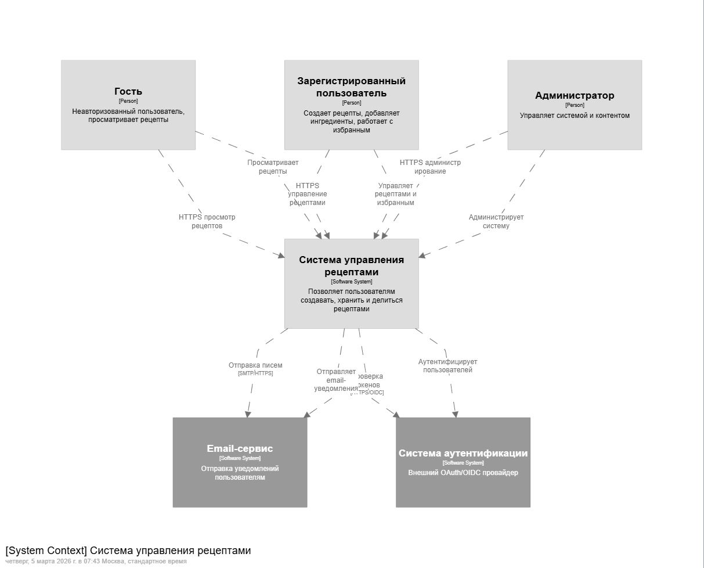
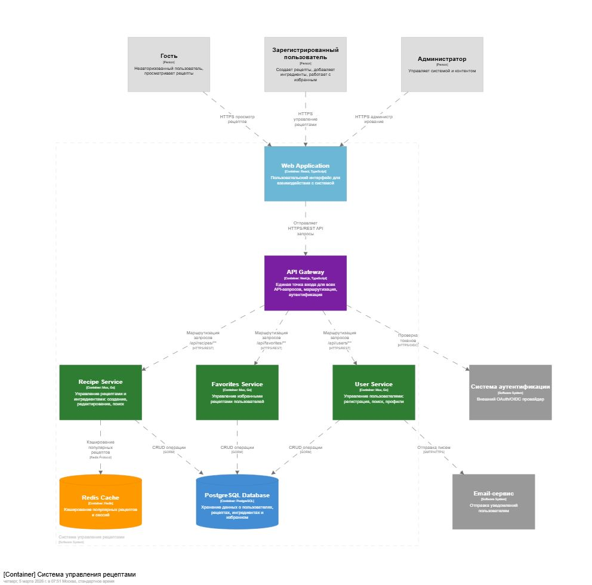
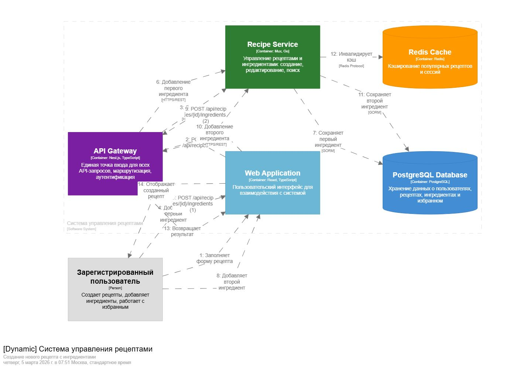

# Домашнее задание 01: Документирование архитектуры в Structurizr

## Вариант 23: Система управления рецептами (аналог allrecipes.com)

### Текст задания

Разработать систему управления рецептами, аналогичную [allrecipes.com](https://www.allrecipes.com/).

**Данные, которые должна содержать система:**
- Пользователь
- Рецепт
- Ингредиент

**Требуемый API:**
1. Создание нового пользователя
2. Поиск пользователя по логину
3. Поиск пользователя по маске имя и фамилии
4. Создание рецепта
5. Получение списка рецептов
6. Поиск рецептов по названию
7. Добавление ингредиента в рецепт
8. Получение ингредиентов рецепта
9. Получение рецептов пользователя
10. Добавление рецепта в избранное

---

## Описание архитектуры

### Роли пользователей

| Роль | Описание |
|------|----------|
| **Гость** | Неавторизованный пользователь, может только просматривать рецепты |
| **Зарегистрированный пользователь** | Может создавать рецепты, добавлять ингредиенты, работать с избранным |
| **Администратор** | Управляет системой и контентом, модернирует рецепты |

### Внешние системы

| Система | Назначение |
|---------|------------|
| **Email-сервис** | Отправка уведомлений пользователям (подтверждение регистрации) |
| **Система аутентификации** | Внешний OAuth/OIDC провайдер для аутентификации пользователей |

### Технологический стек

| Компонент | Технология |
|-----------|------------|
| Web Application | React, TypeScript |
| API Gateway | Nest.js, TypeScript |
| User Service | Mux, Go |
| Recipe Service | Mux, Go |
| Favorites Service | Mux, Go |
| База данных | PostgreSQL |
| Кэш | Redis |

---

## Диаграммы C4

### 1. System Context (C1)

**Описание:** Диаграмма контекста системы показывает высокоуровневое представление системы управления рецептами и её взаимодействие с внешними акторами и системами.

**Элементы диаграммы:**
- **Гость** - просматривает рецепты без авторизации
- **Зарегистрированный пользователь** - создает рецепты и управляет избранным
- **Администратор** - управляет системой и контентом
- **Система управления рецептами** - наша основная система
- **Email-сервис** - внешняя система для отправки уведомлений
- **Система аутентификации** - внешний OAuth/OIDC провайдер

**Основные взаимодействия:**
- Все три типа пользователей взаимодействуют с системой через веб-интерфейс
- Система отправляет email-уведомления через внешний сервис
- Аутентификация делегируется внешнему OAuth/OIDC провайдеру

---

### 2. Container (C2)

**Описание:** Диаграмма контейнеров раскрывает внутреннюю структуру системы управления рецептами, показывая основные технологические компоненты и их взаимодействие.

**Контейнеры:**

| Контейнер | Технология | Ответственность |
|-----------|------------|-----------------|
| **Web Application** | React, TypeScript | Пользовательский интерфейс, взаимодействие с пользователем |
| **API Gateway** | Nest.js, TypeScript | Маршрутизация запросов, аутентификация, единая точка входа |
| **User Service** | Go, Mux | Управление пользователями (регистрация, поиск, профили) |
| **Recipe Service** | Go, Mux | Управление рецептами и ингредиентами |
| **Favorites Service** | Go, Mux | Управление избранными рецептами пользователей |
| **PostgreSQL Database** | PostgreSQL | Хранение всех данных системы |
| **Redis Cache** | Redis | Кэширование популярных рецептов и сессий |

**Взаимодействия:**
- Web App → API Gateway: все запросы проходят через единый шлюз (HTTPS/REST)
- API Gateway → Микросервисы: маршрутизация по эндпоинтам (/api/users/**, /api/recipes/**, /api/favorites/**)
- Микросервисы → База данных: CRUD операции через GORM
- Recipe Service → Redis: кэширование популярных рецептов
- API Gateway → Auth System: проверка JWT токенов

**Принципы взаимодействия:**
- Каждый микросервис отвечает за свою предметную область
- Сервисы не взаимодействуют напрямую друг с другом
- Все запросы проходят через API Gateway для обеспечения безопасности и мониторинга

---

### 3. Dynamic (Создание рецепта)

**Описание:** Диаграмма динамики показывает последовательность взаимодействия между контейнерами при создании нового рецепта с ингредиентами - ключевом сценарии использования системы.

**Сценарий: "Создание нового рецепта с ингредиентами"**

**Последовательность шагов:**

| № | Отправитель | Получатель | Действие | Описание |
|---|-------------|------------|----------|----------|
| 1 | Пользователь | Web App | Заполняет форму рецепта | Пользователь вводит название, описание и другие метаданные рецепта |
| 2 | Web App | API Gateway | POST /api/recipes | Отправка данных нового рецепта |
| 3 | API Gateway | Recipe Service | Создание рецепта | Маршрутизация запроса в Recipe Service |
| 4 | Пользователь | Web App | Добавляет первый ингредиент | Пользователь добавляет первый ингредиент |
| 5 | Web App | API Gateway | POST /api/recipes/{id}/ingredients (1) | Запрос на добавление ингредиента |
| 6 | API Gateway | Recipe Service | Добавление первого ингредиента | Маршрутизация запроса |
| 7 | Recipe Service | Database | Сохраняет первый ингредиент | Запись ингредиента в БД |
| 8 | Пользователь | Web App | Добавляет второй ингредиент | Добавление следующего ингредиента |
| 9 | Web App | API Gateway | POST /api/recipes/{id}/ingredients (2) | Запрос на добавление второго ингредиента |
| 10 | API Gateway | Recipe Service | Добавление второго ингредиента | Маршрутизация запроса |
| 11 | Recipe Service | Database | Сохраняет второй ингредиент | Запись ингредиента в БД |
| 12 | Recipe Service | Redis | Инвалидирует кэш | Очистка устаревших данных в кэше |
| 13 | API Gateway | Web App | Возвращает результат | Ответ об успешном создании |
| 14 | Web App | Пользователь | Отображает созданный рецепт | Обновление интерфейса |

**Архитектурные решения, демонстрируемые сценарием:**
- **Асинхронность** - пользователь может добавлять ингредиенты после создания рецепта
- **Кэширование** - инвалидация кэша при изменении данных
- **Микросервисная архитектура** - каждый шаг обрабатывается соответствующим сервисом
- **Централизованный вход** - все запросы проходят через API Gateway
